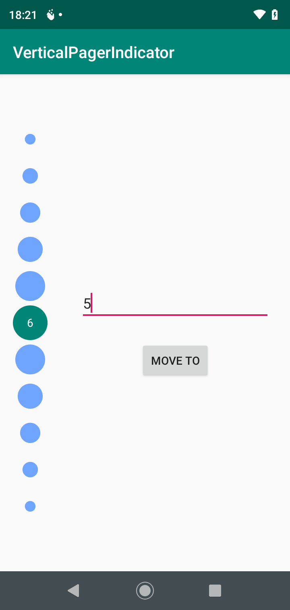

# verticalpagerindicator
Vertical Pager Indicator used with (or without) ViewPager / ViewPager2. Developed as no-alternative solution for vertical indicators 

[](https://jitpack.io/#vardemin/verticalpagerindicator)

## Showcase

&nbsp;&nbsp;&nbsp;&nbsp;&nbsp;
&nbsp;&nbsp;&nbsp;&nbsp;&nbsp;

## Quick Setup
### 1. Include library

**Using Gradle**

verticalpagerindicator is currently available in on Jitpack so add the following line before every other thing if you have not done that already.

```gradle
allprojects {
  repositories {
    ...
    maven { url 'https://jitpack.io' }
  }
}
```
	
Then add the following line 

``` gradle
dependencies {
  implementation 'com.github.vardemin:verticalpagerindicator:v0.1.0'
}
```

### 2. Usage
In your XML layout include the TimelineView as follows:

```xml
    <com.vardemin.verticalpagerindicator.VerticalPagerIndicator
            android:id="@+id/pagerIndicator"
            app:vpi_colorSelected="@color/colorPrimary"
            app:vpi_colorSecondary="@color/colorAccent"
            app:vpi_paddingHorizontal="16dp"
            app:vpi_spacing="24dp"
            app:vpi_colorText="@android:color/white"
            app:vpi_sizeText="24sp"
            android:layout_width="75dp"
            android:layout_height="match_parent"/>
```

## XML Attributes

List of xml attributes that are available in VerticalPagerIndicator

| XML Attribute | Description   | Default |
| ------------- |:---------------:|:---------:| 
|vpi_paddingHorizontal| Set horizontal padding (used for dots sizing) | 16dp|
|vpi_colorSelected|Selected indicator color|#0066FF(colorPrimary)
|vpi_colorSecondary|Secondary indicators color|#70A5FF(colorSecondary)
|vpi_duration|Animation duration|300
|vpi_spacing|Spacing between dots|24dp
|vpi_colorText|Selected indicator text color| white
|vpi_fontText|Selected indicator text typeface| Typeface.DEFAULT
|vpi_sizeText|Selected indicator text size|14sp

## License

VerticalPagerIndicator is distributed under the MIT license. [See LICENSE](https://github.com/vardemin/verticalpagerindicator/blob/master/LICENSE.md) for details.
